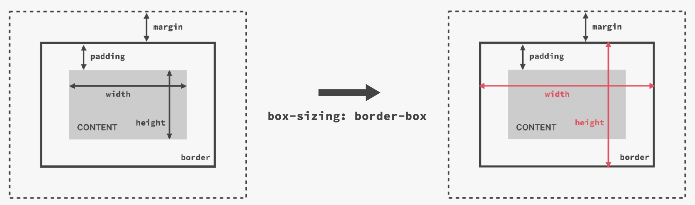
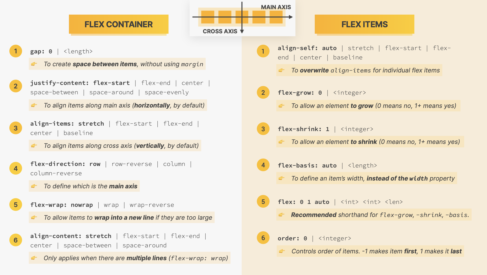

## Packages

- Auto Rename Tag (For HTML)
- Color Highlight (For CSS)
- Image Preview (For HTML)
- One Monokai Theme (For VSCode theme)

## Semantic HTML

- Semantic is giving some meaning to the HTML elements.
- Important for screen readers.

```html
<strong></strong>
<em></em>
<nav></nav>
<article></article>
<header></header>
<footer></footer>
```

## HTML Glyphs

- [HTML Glyphs](https://css-tricks.com/snippets/html/glyphs/)

## Colors in CSS

- White: RGB(255, 255, 255)
- Black: RGB(0,0,0)

#### RGB Notation

- Regular RGB Model
  - rgb(0, 255, 255)
- RGB with transparency ('alpha')
  - rgb(0, 255, 255, 0.3)

#### Hexadecimal Notation

- Instead of using a scale from 0 to 255, we go from **0 to ff** (255 in hexadecimal numbers).
  - #00ffff
- Shorthand, when all colors are identical pairs.
  - #0ff
- In practice, we use hexadecimal Notation unless we need transparency then use rgb

#### Shades of grey

- When colors in all 3 channels are the same, we get a **grey color**.
- There are 256 pure grays to choose from.
  - rgb(0,0,0), #000000, #000
  - rgb(69,69,69), #444444, #444
  - rgb(183,183,183), #b7b7b7
  - rgb(255,255,255), #ffffff, #fff

# Conflicts between Selectors

- When there are multiple selectors targeting the same element, all of them are applied but which has the highest priority?

```
Highest Priority
  1. Declarations marked !important
  2. Inline style (style attribute in HTML)
  3. ID (#) Selector
  4. Class (.) or pseudo-class (:) selector
  5. Element selector (p, div, li, etc.)
  6. Universal selector (\*)
Lowest Priority
```

# How Inheritance Works?

- Not all properties get inherited. It is mostly the ones **lated to text**: font-family, font-size, font-weight, font-size, ...

```css
body {
  color: #444444;
}

/* Overrides the inherited style of #444 */
h1 {
  color: #1098ad;
}
```

```html
<body>
  <h1>My Website</h1>
</body>
```

## CSS Box Model

- Content: Text, images, etc.
- Border: A line around the element, still inside of the element.
- Padding: Invisible space around the content, inside of the element. (between content and border).
- Margin: Space outside of the element, between elements.
- Fill area: Area that gets filled with background color or background image.

## Element Height and Width Calculation

- Final element width = left border + left padding + width + right padding + right border
- Final element height = top border + top padding + height + bottom padding + bottom border

#### Shorthand notation

- `padding: 20px 40px;`
  - top and bottom, left and right

## Collapsing Margins

- Affects how vertical margins between adjacent elements are handled.
- When 2 adjacent elements have margins that touch or overlap, the margins collapse into a single margin, which is equal to the **larger** of the 2 margins.

# CSS: Types of Boxes

### Inline Elements

- Occupies only the space **necessary for its content**.
- Causes **no line-breaks** after or before the element.
- Box model applies in a different way: **heights and widths do not apply**.
- **Padding and margins** are applied **only horizontally** (left and right).
- These elements are typically used to wrap small bits of text or other inline content, such as icons or images.
- `<span>, <a>, <em>, and <strong>`
- **With CSS: `display: inline`**

### Block-Level Elements

- Elements are formatted visually as blocks.
- Elements occupy **100% of parent element's width, no matter the content**.
- Elements are **stacked vertically** by default, one after another.
- `<div>, <p>, <h1>-<h6>, and <ul>/<ol>`
- **With CSS: `display: block`**
  - Changing inline elements to block level elements

### Inline-Block Elements

- Inline-block elements are a hybrid of inline and block-level elements.
- They take up only as much space as their content needs but they can also have padding, margin, and border set on them, just like block-level elements.
- `<button>, <input>,  and <label>`
- **With CSS: `display: inline-block`**

# CSS: Position Nodes

### Normal flow

- Default positioning
- Element is **in** flow.
- Elements are simply laid out according to their order in the HTML code.
- **With CSS: `position: relative`**

### Absolute positioning

- Element is removed from the normal flow: **out** of flow
- No impact on surrounding elements, might overlap them.
- Use top, bottom, left or right to offset the element from its **relatively positioned container**.
- If the parent element has `position: relative` property, can set the position of the child element with `position: absolute` inside this parent container.
- **With CSS: `position: absolute`**

# Pseudo-Elements

- Used to style specific parts of an element.
- Can style parts of an element that don't actually exist in the HTML markup.
- Denoted by 2 colons `::` before the element name.

### `::before` and `::after`

- Allows you to add content before or after the content of an element.

```css
/* Adding an icon or bullet point before each list item in an unordered list */
ul li::before {
  content: "♥️"; /* "content" is used to specify the content to be added. */
  margin-right: 0.5em;
}
```

### Using pseudo-elements to style other parts of an element

- Can used to style the first letter or first line of a paragraph.

```css
p::first-letter {
  font-size: 150%;
  font-weight: bold;
}

p::first-line {
  font-style: italic;
}
```

### Adjacent sibling

- Inside a parent element, there are many child elements.
- The adjacent sibling is the next child that comes after a particular child element.

```css
h3 + p::first-line {
  color: red;
}
```

# Building Layouts

### Layout

- Layout is the way test, images and other content is placed and arranged on a webpage.
- Layouts give the page a visual structure, into which we place our content.
- **Building a layout**: arranging page elements into a visual structure.

### Float layouts (old)

- Removes the element out of the document flow.
- Element is removed from the normal flow: **out of** flow
- Text and inline elements will wrap around the floated element.
- The container will **not** adjust its height to the element.
- `float: left`, `float: right`

#### Clearing Floats

- Method 1: Specifying an empty `div` and then clear both floats.

```css
<div class="clear" > </div > .clear {
  clear: both;
}
```

- Method 2: Using `clearfix` by specifying the class on the parent element

```css
<header class="main-header clearfix" > .clearfix::after {
  content: "";
  clear: both;
  display: block;
}
```

### `box-sizing: border-box`



### Flexbox

- Flexbox is a set of related **CSS properties** for **building 1-dimensional layouts**.
- The main idea behind flexbox is that empty space inside a container element can be **automatically divided** by its child elements.
- Flexbox makes it easy to automatically **align items to one another** inside a parent container, both horizontally and vertically.
- Flexbox solves common problems such as **vertical centering** and creating **equal-height columns**.
- Flexbox is perfect for **replacing floats**, allowing us to write fewer and cleaner HTML and CSS code.
- To create a flex container: `display: flex`, child elements become the flex items.



### CSS Grid

- For laying out element in a fully-fledged **2-dimensional grid**. Perfect for **page layouts and complex components**.
