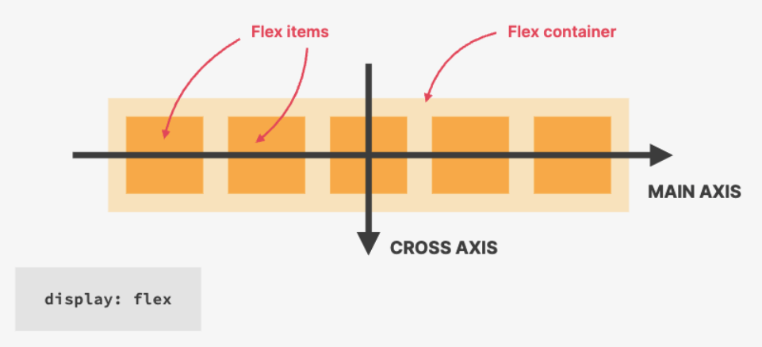
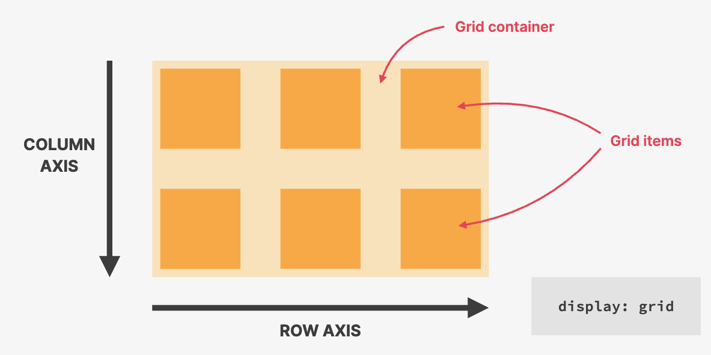
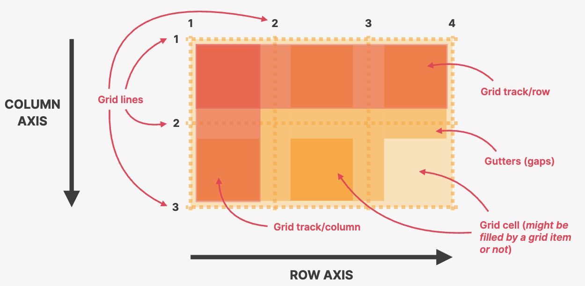
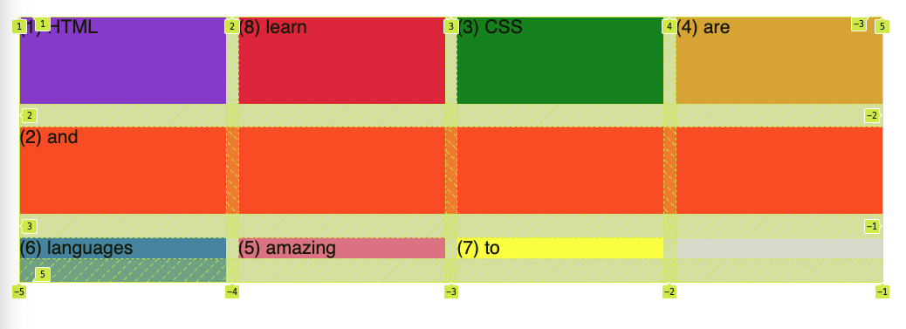

## Packages in VSCode

- Auto Rename Tag (For HTML)
- Color Highlight (For CSS)
- Image Preview (For HTML)
- One Monokai Theme (For VSCode theme)

# HTML

## Semantic HTML

- Semantic is giving some meaning to the HTML elements.
- Important for screen readers.

```html
<strong></strong>
<em></em>
<nav></nav>
<article></article>
<header></header>
<footer></footer>
```

## HTML Glyphs

- [HTML Glyphs](https://css-tricks.com/snippets/html/glyphs/)

# CSS

## 3 Ways - Inline, Internal, and External

1. Inline: `<h1 style="color:red">Hello</h1>`
2. Internal:

```html
<head>
  <style>
    h1 {
      color: blue;
    }
  </style>
</head>
```

3. External:

```html
<head>
  <link href="style.css" rel="stylesheet" />
</head>
```

## Styling Text

| CSS               | Description                                                   |
| ----------------- | ------------------------------------------------------------- |
| `font-size: 20px` | Font Size                                                     |
| `font-family`     | Font family e.g., sans-serif                                  |
| `text-transform`  | Make the text uppercase. E.g., `text-transform: uppercase`    |
| `font-style`      | Can set the text to italic. E.g., `font-style: italic`        |
| `line-height`     | To increase space between the lines. E.g., `line-height: 1.5` |
| `text-align`      | Aligns the text. E.g., `text-align: center`                   |
| `font-weight`     | Can make text bold. E.g., `font-weight: bold`                 |

## Styling Lists

| CSS          | Description                                                             |
| ------------ | ----------------------------------------------------------------------- |
| `list-style` | Remove bullet points by adding this to `<ul>`. E.g., `list-style: none` |

## Colors in CSS

---

#### RGB Notation

- White: rgb(255, 255, 255)
- Black: rgb(0,0,0)
- Regular RGB Model: rgb(0, 255, 255)
- RGB with transparency ('alpha'): rgb(0, 255, 255, 0.3)

---

#### Hexadecimal Notation

- Instead of using a scale from 0 to 255, we go from **0 to ff** (255 in hexadecimal numbers).
  - #00ffff
- Shorthand, when all colors are identical pairs.
  - #0ff
- In practice, we use hexadecimal Notation **unless we need transparency then use rgb**

---

#### Shades of grey

- When colors in all 3 channels are the same, we get a **grey color**.
- There are 256 pure grays to choose from.
  - rgb(0,0,0), #000000, #000
  - rgb(69,69,69), #444444, #444
  - rgb(183,183,183), #b7b7b7
  - rgb(255,255,255), #ffffff, #fff

---

| CSS                | Description                                                    |
| ------------------ | -------------------------------------------------------------- |
| `background-color` | Background color of an element.                                |
| `border`           | Accepts multiple values (shorthand). E.g., `5px solid #1098ad` |

---

## Selectors

---

#### Combining Selectors

```css
/* List selector */
h1,
h2,
h3,
h4,
p,
li {
  font-family: sans-serif;
}

/* Descendant Selector */
footer p {
  font-size: 16px;
}
```

---

#### Class and ID Selectors

```css
/* ID */
#author {
  font-style: italic;
}

/* Class */
.related-author {
  font-size: 18px;
  font-weight: bold;
}
```

---

#### Pseudo-Classes

- Styling the first element. E.g., for `<li>` elements

```css
/* First child of its parent element */
li:first-child {
  font-weight: bold;
}

li:last-child {
}

/* Target specific child --> 2nd child */
li:nth-child(2) {
}

/* Target odd and even elements (can be used to style table rows) */
li:nth-child(odd) {
}
li:nth-child(even) {
}

/* Does not work if <p> is not the first child of <article> ! 
   Let's say if a <div> comes after <article> ... */
article p:first-child {
  color: red;
}
```

---

#### Style Hyperlinks (with pseudo-class)

```cs
/* Not a good practice. Will also work if <a> element does not have `href` attribute */
a {
  color: #1098ad;
}

/* Better practice. Will work if <a> element has the `href` attribute */
a:link {
  color: #1098ad;
  text-decoration: none; /* get rid of the underline in links */
}

/* Giving the visited links a color */
a:visited {
  color: #777;
}

a:hover {
  color: orangered;
  font-weight: bold;
  text-decoration: underline;
  // text-decoration: underline wavy orangered;
}

a:active {
  background-color: black;
  font-style: italic;
}

/* Arrange the above pseudo classes in order. LVHA (link --> visited --> hover --> active) */
```

---

#### Conflicts between Selectors

- When there are multiple selectors targeting the same element, all of them are applied but which has the highest priority?

```
Highest Priority
  1. Declarations marked !important
  2. Inline style (style attribute in HTML)
  3. ID (#) Selector
  4. Class (.) or pseudo-class (:) selector
  5. Element selector (p, div, li, etc.)
  6. Universal selector (*)
Lowest Priority
```

---

#### How Inheritance Works?

- Not all properties get inherited. It is mostly the ones **related to text**: font-family, font-size, font-weight, font-style, color, line-height, letter-spacing, text-align, text-transform, text-shadow, list-style, etc.

```css
body {
  color: #444444;
  font-family: sans-serif;
}

/* Overrides the inherited style of #444 in body */
h1 {
  color: #1098ad;
}
```

```html
<body>
  <h1>My Website</h1>
</body>
```

---

#### Universal Selector

- Selects every single element on the page. Not just those related to _text_.

```css
* {
}
```

---

## CSS Box Model

- Content: Text, images, etc.
- Border: A line around the element, still inside of the element.
- Padding: Invisible space around the content, inside of the element. (between content and border).
- Margin: Space outside of the element, between elements.
- Fill area: Area that gets filled with background color or background image.

## Element Height and Width Calculation

- Final element width = left border + left padding + width + right padding + right border
- Final element height = top border + top padding + height + bottom padding + bottom border

#### Shorthand notation

- `padding: 20px 40px;`
  - top and bottom, left and right

## Collapsing Margins

- Affects how vertical margins between adjacent elements are handled.
- When 2 adjacent elements have margins that touch or overlap, the margins collapse into a single margin, which is equal to the **larger** of the 2 margins.

# CSS: Types of Boxes

### Inline Elements

- Occupies only the space **necessary for its content**.
- Causes **no line-breaks** after or before the element.
- Box model applies in a different way: **heights and widths do not apply**.
- **Padding and margins** are applied **only horizontally** (left and right).
- These elements are typically used to wrap small bits of text or other inline content, such as icons or images.
- `<span>, <a>, <em>, and <strong>`
- **With CSS: `display: inline`**

### Block-Level Elements

- Elements are formatted visually as blocks.
- Elements occupy **100% of parent element's width, no matter the content**.
- Elements are **stacked vertically** by default, one after another.
- `<div>, <p>, <h1>-<h6>, and <ul>/<ol>`
- **With CSS: `display: block`**
  - Changing inline elements to block level elements

### Inline-Block Elements

- Inline-block elements are a hybrid of inline and block-level elements.
- They take up only as much space as their content needs but they can also have padding, margin, and border set on them, just like block-level elements.
- `<button>, <input>,  and <label>`
- **With CSS: `display: inline-block`**

# CSS: Position Nodes

### Normal flow

- Default positioning
- Element is **in** flow.
- Elements are simply laid out according to their order in the HTML code.
- **With CSS: `position: relative`**

### Absolute positioning

- Element is removed from the normal flow: **out** of flow
- No impact on surrounding elements, might overlap them.
- Use top, bottom, left or right to offset the element from its **relatively positioned container**.
- If the parent element has `position: relative` property, can set the position of the child element with `position: absolute` inside this parent container.
- **With CSS: `position: absolute`**

# Pseudo-Elements

- Used to style specific parts of an element.
- Can style parts of an element that don't actually exist in the HTML markup.
- Denoted by 2 colons `::` before the element name.

### `::before` and `::after`

- Allows you to add content before or after the content of an element.

```css
/* Adding an icon or bullet point before each list item in an unordered list */
ul li::before {
  content: '♥️'; /* "content" is used to specify the content to be added. */
  margin-right: 0.5em;
}
```

### Using pseudo-elements to style other parts of an element

- Can used to style the first letter or first line of a paragraph.

```css
p::first-letter {
  font-size: 150%;
  font-weight: bold;
}

p::first-line {
  font-style: italic;
}
```

### Adjacent sibling

- Inside a parent element, there are many child elements.
- The adjacent sibling is the next child that comes after a particular child element.

```css
h3 + p::first-line {
  color: red;
}
```

# Building Layouts

## Layout

- Layout is the way test, images and other content is placed and arranged on a webpage.
- Layouts give the page a visual structure, into which we place our content.
- **Building a layout**: arranging page elements into a visual structure, instead of simply having them placed one after another (normal flow).
- Page layout vs Component layout
  - Components themselves also need to have layouts within themselves
- 3 Ways of building layouts
  - Float layouts
  - Flex Box
    - Good for laying out 1-dimensional row. Perfect for component layouts
  - Grid
    - Good for 2-dimensional grids. Perfect for page and component layouts.

## Float layouts (old websites)

- Removes the element out of the document flow like `position: absolute`
- Element is removed from the normal flow: **out of** flow
- Text and inline elements will wrap around the floated element.
- The container will **not** adjust its height to the child element that has float applied to it.
  - Solution: Clear floats
- `float: left`, `float: right`

### Clearing Floats

- **Method 1**: Adding an empty `div` element as the last child and then clear both floats.

```html
<header class="main-header">
  <h1>📘 The Code Magazine</h1>

  <nav>
    <!-- <strong>This is the navigation</strong> -->
    <a href="blog.html">Blog</a>
    <a href="#">Challenges</a>
    <a href="#">Flexbox</a>
    <a href="#">CSS Grid</a>
  </nav>

  <div class="clear"></div>
</header>
```

```css
h1 {
  float: left;
}

nav {
  float: right;
}

.clear {
  clear: both;
}
```

- **Method 2**: Using `clearfix` by specifying the class on the parent element

```html
<header class="main-header clearfix">
  <h1>📘 The Code Magazine</h1>

  <nav>
    <!-- <strong>This is the navigation</strong> -->
    <a href="blog.html">Blog</a>
    <a href="#">Challenges</a>
    <a href="#">Flexbox</a>
    <a href="#">CSS Grid</a>
  </nav>
</header>
```

```css
/* 
use pseudo elements `::after` which creates a content on the last child element. 
When using pseudo elements, it applies to inline elements, so we need `display: block
We also need to specify some content when using `::after`
*/
.clearfix::after {
  content: '';
  clear: both;
  display: block;
}
```

### `box-sizing: border-box`


```css
* {
  margin: 0;
  padding: 0;
  box-sizing: border-box;
}
```

- By default, when you set the width and height of an element using CSS, those values only apply to the content of the element and do not include the padding and border.
- When you set it to `border-box`, the specified width and height include the content, padding and border of the element.
- Final Element Width = width
- Final Element Height = height

## Flexbox




- Flexbox is a set of related **CSS properties** for **building 1-dimensional layouts**.
- The main idea behind flexbox is that empty space inside a container element can be **automatically divided** by its child elements.
- Flexbox makes it easy to automatically **align items to one another** inside a parent container, both horizontally and vertically.
- Flexbox solves common problems such as **vertical centering** and creating **equal-height columns**.
- Flexbox is perfect for **replacing floats**, allowing us to write fewer and cleaner HTML and CSS code.
- To create a flex container: `display: flex`, child elements become the flex items.
- `justify-content` is for main-axis (horizontal) and `align-items` is for cross-axis (vertical)
- `align-self` aligns individual flex items
- `order` to align the position of flex item, by default it is `order: 0`.
- `gap` in flex container to separate flex items

### `flex-grow`, `flex-shrink`, `flex-basis`

```css
/* DEFAULT */
.el--1 {
  flex-grow: 0;
  flex-shrink: 1;
  flex-basis: auto;
}
```

- `flex-basis` sets a width to the flex items in the container. It will shrink as you resize the browser to fit the flex container and this width changes because `flex-shrink: 1`
- `flex-shrink: 0` will prevent resizing the flex items when you resize the browser but then the flex items will not fit the container and overflow the container. `flex-shrink` is to determine whether flexbox is allowed to shrink the items or not.
- `flex-grow: 1;` to fill up the remaining spaces that are not occupied in the container. Can either set this to the flex container or flex item. Setting `flex-grow` in the flex container will make all the flex items have the same size.
- **Shorthand Property**, we use `flex: 1` to define the above 3 properties.
  - `flex: 0 0 200px` means `flex-grow: 0`, `flex-shrink: 0`, `flex-basis: 200px`

### `flex-direction`

- `flex-direction: column`
  - the main-axis (horizontal) now becomes vertical axis
  - `align-items` aligns items horizontally, no longer vertically.
  - `justify-content` aligns items vertically, no longer horizontally.
  - `gap` acts like **margin-bottom**, no longer like margin-right.

## CSS Grid

- In CSS Grid, we have Grid Container and Grid Items.
- CSS Grid is a set of CSS properties for building **2-dimensional layouts**.
- The main idea behind CSS Grid is that we divide a container element into rows and columns that can be filled with its child elements.
- In two-dimensional contexts, CSS Grid allows us to write less nested HTML and easier-to-read CSS.
- CSS Grid is not meant to replace flexbox! Instead, they work perfectly together.
  - Need a 1D layout? Use flexbox.
  - Need a 2D layout? Use CSS Grid.





### `grid-template-columns` and `grid-template-rows`

- `grid-template-columns` defines the columns of the grid
  - `grid-template-columns: 200px 200px 100px 100px;` specifies **4 columns** with widths of 200px, 200px, 100px and 100px.
- `grid-template-rows` defines the rows of the grid
  - `grid-template-rows: 300px 200px;` specifies **two rows** with heights of 300px, 200px

### `gap`, `column-gap` and `row-gap`

- `gap` is a **shorthand** property for specifying the gap between columns and rows in a grid layout.
- `column-gap: 30px;` sets the gap between columns to 30px.
- `row-gap: 60px;` sets the gap between rows to 60px;

### Using `fr` instead of `px`

```css
grid-template-columns: 2fr 2fr 1fr 1fr;
grid-template-rows: 3fr 2fr;
```

- Using `fr` (fractional unit) in CSS Grid instead of `px` is about creating more flexible and **responsive** layouts.
- `px` created fixed dimensions while `fr` fills up the container.
- If you resize the browser window, the grid items will resize too.

```css
grid-template-columns: 1fr 1fr 1fr auto;
```

- `grid-template-columns: 1fr 1fr 1fr auto;` means the first 3 columns will have 1 fractional unit and the last column will have just sufficient width to fill its content.

```css
/* Shorter syntax */
grid-template-columns: 1fr 1fr 1fr 1fr;
grid-template-columns: repeat(4, 1fr);
```

- `fr` unit is usually more common for `grid-template-rows`

### Grid Items `grid-column` and `grid-row`



```css
.el--8 {
  grid-column: 2 / 3;
  grid-row: 1 / 2;
}

.el--8 {
  grid-column: 2;
  grid-row: 1;
}
```

- In grid systems, the columns and rows are numbered.
- `grid-column` defines the placement of the grid item along the **horizontal axis (columns)**.
  - `grid-column: 2 / 3;` the items starts at the second grid line and ends at the third grid line.
  - `grid-column: 1 / -1;`: `-1` indicates that it ends at the last column, it is a convenient shorthand in grid layouts for "last" column.
- `grid-row` defines the placement of the grid item alone the **vertical axis (rows)**.
  - `grid-row: 1 / 2;` the item starts at the first grid line and ends at the second grid line.
- If the difference is only by 1 like `grid-row: 2 / 3;`, we can just use `grid-row: 2`. They are the same.
- `grid-column: 1 / 4;` is the same as `grid-column: 1 / span 3;` where it spans across 3 columns.

### Aligning Grid Items and Tracks

```css
.grid-container {
  /* 
Aligning tracks inside container: 
distribute empty space 
*/
  justify-content: center;
  /* justify-content: space-between; */
  align-content: center;

  /* 
Aligning items INSIDE cells: 
moving items around inside cells 
*/
  align-items: center;
  justify-items: center;
}

.el--3 {
  align-self: end;
  justify-self: end;
}
```

- Happens when the grid container is bigger than the grid items.
- `align-content: center;` and `justify-content: center` centers the tracks of the entire grid.
- `align-items: center` and `justify-items: center` centers the items inside the grid cells vertically and horizontally respectively.
- `align-self: end` and `justify-self: end` aligns the individual grid cell to the end of the cell vertically and horizontally respectively.
